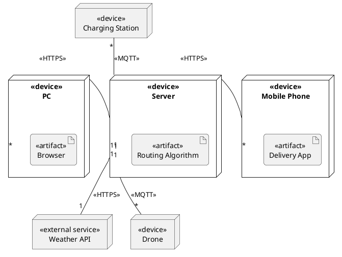
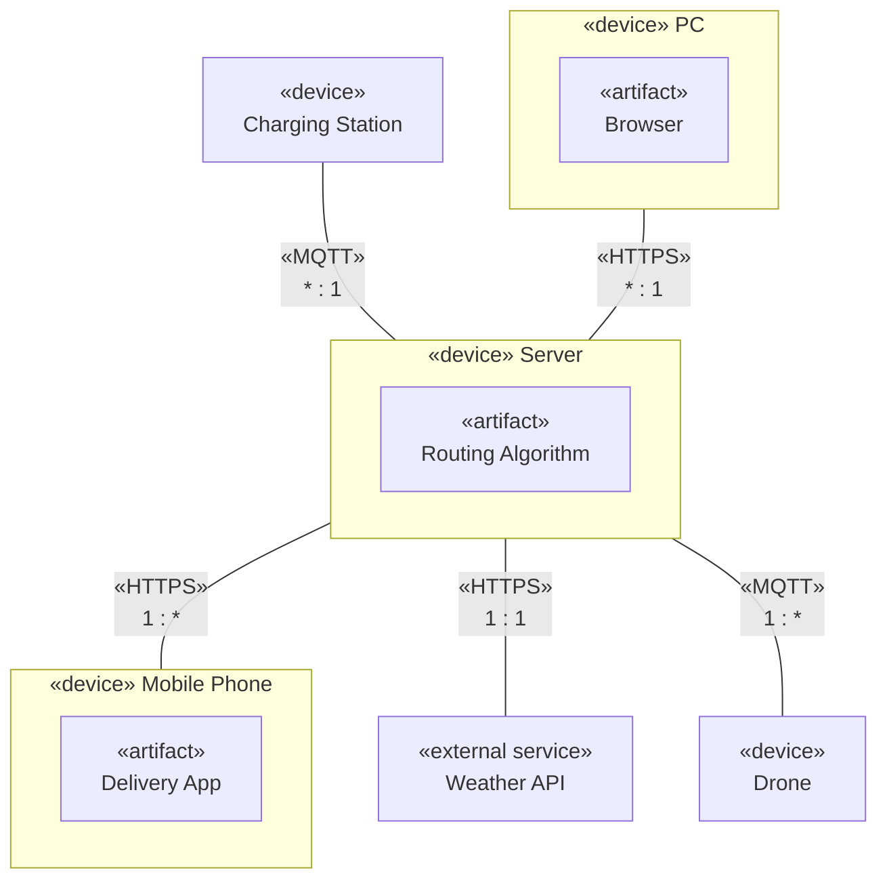

# Deployment Diagram

This document contains the system's deployment diagram based on the provided architecture.

## PlantUML Representation

PlantUML natively supports UML deployment diagrams and perfectly captures the semantics of the architecture.

## Mermaid Representation

Mermaid is widely supported in markdown renderers (like GitHub/GitLab). While it doesn't have a strict UML deployment diagram type, we can represent it using a flowchart.

