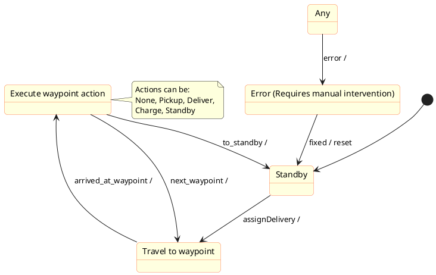

# State Machine 1: Drone Behaviour

This document contains the state machine diagram representing the behavior of the drone.

## PlantUML Representation

```plantuml
@startuml
skinparam roundcorner 10
skinparam state {
  BackgroundColor LightYellow
  BorderColor Coral
}

state "Standby" as Standby
state "Travel to waypoint" as Travel
state "Execute waypoint action" as Execute
state "Error (Requires manual intervention)" as Error
state "Any" as AnyState

[*] --> Standby

Standby --> Travel : assignDelivery /
Travel --> Execute : arrived_at_waypoint /
Execute --> Travel : next_waypoint /
Execute --> Standby : to_standby /
AnyState --> Error : error /
Error --> Standby : fixed / reset

note right of Execute
  Actions can be:
  None, Pickup, Deliver,
  Charge, Standby
end note

@enduml
```
