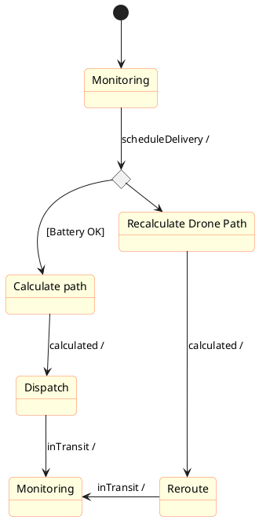

# State Machine 2: Server Delivery

This document contains the state machine diagram representing the server delivery flow.

## PlantUML Representation

```plantuml
@startuml
skinparam roundcorner 10
skinparam state {
  BackgroundColor LightYellow
  BorderColor Coral
}

state "Monitoring" as Monitoring1
state "Calculate path" as CalculatePath
state "Recalculate Drone Path" as RecalculatePath
state "Dispatch" as Dispatch
state "Reroute" as Reroute
state "Monitoring" as Monitoring2
state choice1 <<choice>>

[*] -down-> Monitoring1

Monitoring1 -down-> choice1 : scheduleDelivery /

choice1 -down-> CalculatePath : [Battery OK]
choice1 -right-> RecalculatePath : [Unexpected Battery\nDrainage]

CalculatePath -down-> Dispatch : calculated /
RecalculatePath -down-> Reroute : calculated /

Dispatch -down-> Monitoring2 : inTransit /
Reroute -left-> Monitoring2 : inTransit /

@enduml
```
