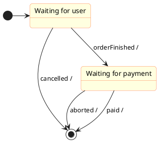

# State Machine 3: Server Clients

This document contains the state machine diagram representing the server clients flow.

## PlantUML Representation

```plantuml
@startuml
skinparam roundcorner 10
skinparam state {
  BackgroundColor LightYellow
  BorderColor Coral
}

state "Waiting for user" as WaitingForUser
state "Waiting for payment" as WaitingForPayment

[*] -right-> WaitingForUser

WaitingForUser -right-> [*] : cancelled /
WaitingForUser -down-> WaitingForPayment : orderFinished /

WaitingForPayment -right-> [*] : aborted /
WaitingForPayment -down-> [*] : paid /

@enduml
```
