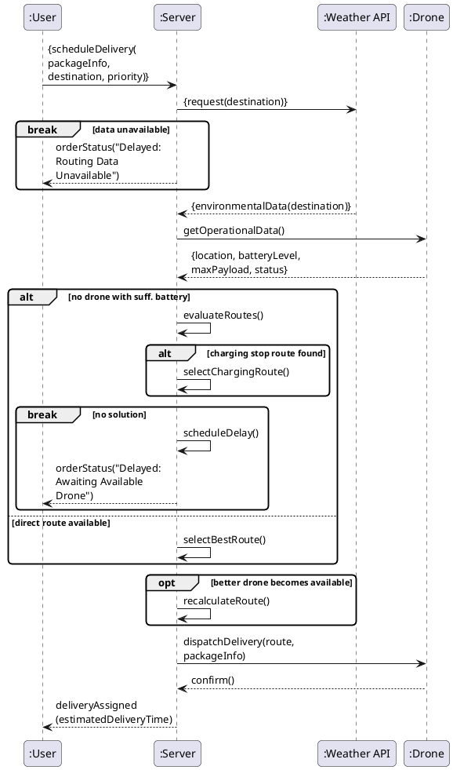

# Use Case 1: Sequence Diagram

This sequence diagram represents the flow for scheduling a delivery and calculating the route.

## PlantUML Representation

```plantuml
@startuml
skinparam roundcorner 10
skinparam maxmessagesize 150

participant ":User" as User
participant ":Server" as Server
participant ":Weather API" as WeatherAPI
participant ":Drone" as Drone

User -> Server: {scheduleDelivery(\npackageInfo, destination, priority)}
Server -> WeatherAPI: {request(destination)}

break data unavailable
    Server --> User: orderStatus("Delayed:\nRouting Data Unavailable")
end

WeatherAPI --> Server: {environmentalData(destination)}
Server -> Drone: getOperationalData()
Drone --> Server: {location, batteryLevel, maxPayload, status}

alt no drone with suff. battery
    Server -> Server: evaluateRoutes()
    
    alt charging stop route found
        Server -> Server: selectChargingRoute()
    end
    
    break no solution
        Server -> Server: scheduleDelay()
        Server --> User: orderStatus("Delayed:\nAwaiting Available Drone")
    end
else direct route available
    Server -> Server: selectBestRoute()
end

opt better drone becomes available
    Server -> Server: recalculateRoute()
end

Server -> Drone: dispatchDelivery(route, packageInfo)
Drone --> Server: confirm()
Server --> User: deliveryAssigned\n(estimatedDeliveryTime)

@enduml
```
