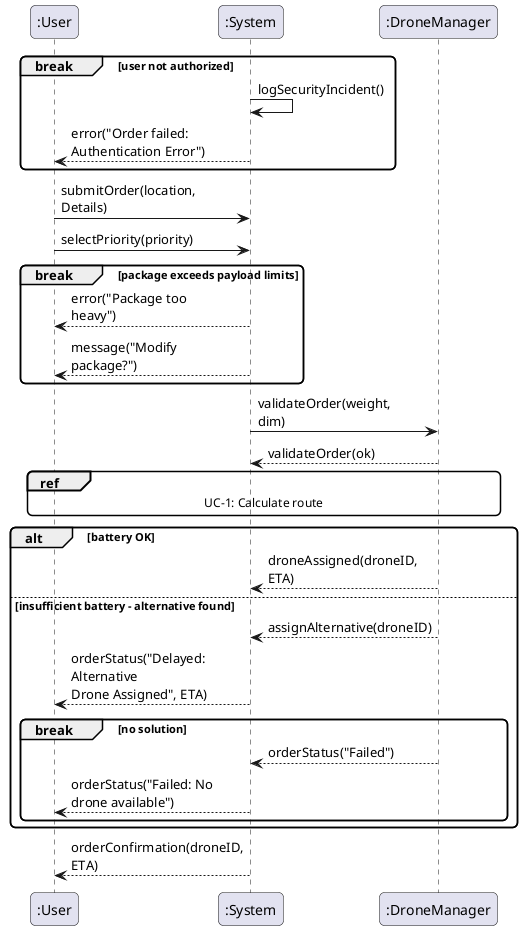

# Use Case 2: Sequence Diagram

This sequence diagram represents the order submission, validation, and assignment flow.

## PlantUML Representation

```plantuml
@startuml
skinparam roundcorner 10
skinparam maxmessagesize 150

participant ":User" as User
participant ":System" as System
participant ":DroneManager" as DroneManager

break user not authorized
    System -> System: logSecurityIncident()
    System --> User: error("Order failed:\nAuthentication Error")
end

User -> System: submitOrder(location, Details)
User -> System: selectPriority(priority)

break package exceeds payload limits
    System --> User: error("Package too heavy")
    System --> User: message("Modify package?")
end

System -> DroneManager: validateOrder(weight, dim)
DroneManager --> System: validateOrder(ok)

ref over User, System, DroneManager : UC-1: Calculate route

alt battery OK
    DroneManager --> System: droneAssigned(droneID, ETA)
else insufficient battery - alternative found
    DroneManager --> System: assignAlternative(droneID)
    System --> User: orderStatus("Delayed: Alternative\nDrone Assigned", ETA)
    
    break no solution
        DroneManager --> System: orderStatus("Failed")
        System --> User: orderStatus("Failed: No\ndrone available")
    end
end

System --> User: orderConfirmation(droneID, ETA)

@enduml
```
