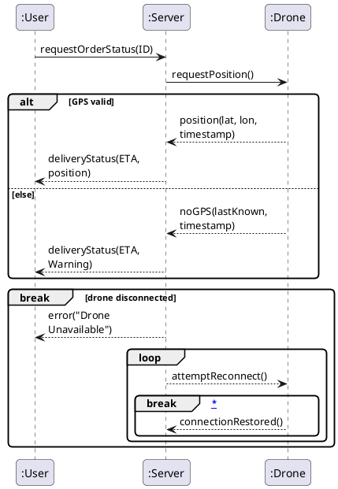

# Use Case 3: Sequence Diagram

This sequence diagram represents the order tracking and drone status monitoring flow.

## PlantUML Representation

```plantuml
@startuml
skinparam roundcorner 10
skinparam maxmessagesize 150

participant ":User" as User
participant ":Server" as Server
participant ":Drone" as Drone

User -> Server: requestOrderStatus(ID)
Server -> Drone: requestPosition()

alt GPS valid
    Drone --> Server: position(lat, lon, timestamp)
    Server --> User: deliveryStatus(ETA, position)
else else
    Drone --> Server: noGPS(lastKnown, timestamp)
    Server --> User: deliveryStatus(ETA, Warning)
end

break drone disconnected
    Server --> User: error("Drone Unavailable")
    
    loop
        Server --> Drone: attemptReconnect()
        
        break [*]
            Drone --> Server: connectionRestored()
        end
    end
end

@enduml
```
