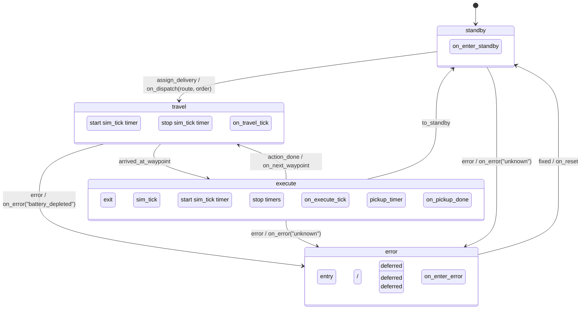
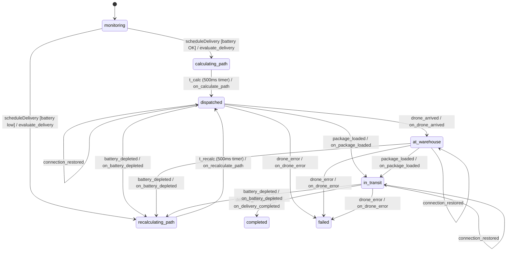
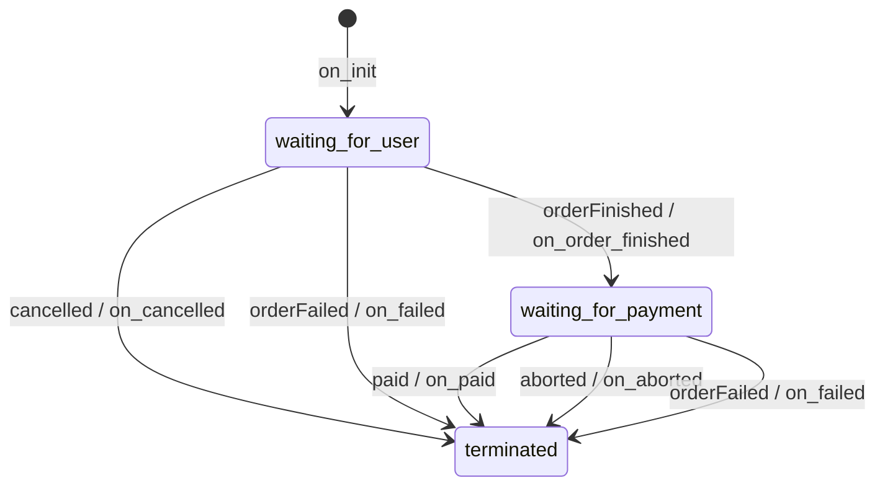

# State Machines

State machines are implemented using [stmpy](https://falkr.github.io/stmpy/) and run on a shared `stmpy.Driver` in `server/main.py`.

## DroneSTM — `drone/main.py`

Manages a single drone's physical state: movement between waypoints, executing actions (pickup, delivery, charging), and error recovery.

## DeliveryState — `server/delivery_state.py`

Tracks the lifecycle of a delivery order from scheduling through completion or failure. One instance per order.

## ClientState — `server/client_state.py`

Intended to track the client session (order placement, payment). Currently scaffolded for future implementation — the server bypasses it by sending `orderFinished` and `paid` immediately on order creation, so the machine transitions straight to `terminated` without pausing.

